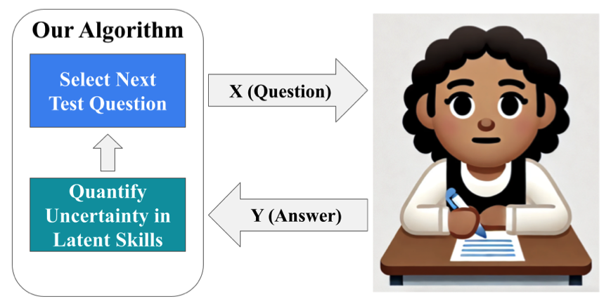

# Adaptive Elicitation of Latent Information Using Natural Language 

<p align="center">
  
</p>

This repository contains code for the paper [Adaptive Elicitation of Latent Information Using Natural Language](https://arxiv.org/pdf/2504.04204) by Jimmy Wang*, Thomas Zollo*, Richard Zemel, and Hongseok Namkoong. 

LLMs currently lack mechanisms for strategically gathering information to quantify and reduce uncertainty. We introduce an adaptive elicitation framework that meta-learns an LLM and uses future simulation to continually choose the most informative questions to ask. 

---

### Installation

1. Clone Adaptive Elicitation repository.
```bash
git clone git@github.com:namkoong-lab/adaptive-elicitation.git
cd adaptive-elicitation
```

2. Create the environment.
```bash
conda create -n ada-elicit python=3.13
conda activate ada-elicit
pip install -r requirements.txt
pip install -e .
```

---

### Datasets 
We use three datasets to train and evaluate our method: our Twenty Questions dataset, [OpinionQA](https://github.com/tatsu-lab/opinions_qa) and [EEDI](https://eedi.com/us/projects/neurips-education-challenge). 

The raw data files we use can be downloaded [here](https://drive.google.com/drive/folders/1WKtcH6Eu6StEB5Pi1ttZJj7bEEhdDGp7?usp=sharing).

* **Twenty Questions**: create `./data/raw/twentyq` and add the files from the "Twenty Questions" folder from [this link](https://drive.google.com/drive/folders/1WKtcH6Eu6StEB5Pi1ttZJj7bEEhdDGp7?usp=sharing).

* **Opinion QA**: create `./data/raw/opinion_qa` and add:
    * 'human_resp' from this link: https://worksheets.codalab.org/worksheets/0x6fb693719477478aac73fc07db333f69
    * both files from the "OpinionQA" folder at [this link](https://drive.google.com/drive/folders/1WKtcH6Eu6StEB5Pi1ttZJj7bEEhdDGp7?usp=sharing).

* **EEDI**:  Create `./data/raw/eedi` and add the files from [this link](https://drive.google.com/drive/folders/1WKtcH6Eu6StEB5Pi1ttZJj7bEEhdDGp7?usp=sharing). 

---

### Processing Data 

Once the raw dataset files have been downloaded, you process the data into cleaned form by running this script for each dataset: 

```bash 
python scripts/generate_data.py --dataset <DATASET NAME>
```

The `--dataset` argument can consist of `twentyq`, `opinion_qa`, `eedi`. Running this script will leave the processed files in `./data/processed/<DATASET NAME>`. 

--- 

### Training the Model 

To train our model, we finetune a base LLM (one of `GPT2`, `Llama-3.2-1B`, `Llama-3.1-8B`) in our experiments on each dataset. To initiate the training run, we use this script: 

```bash

python scripts/finetune/run_finetune.py \
    --root_data_dir=<ROOT_DATA_DIR> \
    --dataset=<DATASET> \
    --split=<DATASET_SPLIT> \
    --model_name=<MODEL_NAME> \
    --wandb \
    --save_dir=<SAVE_DIR> \
    --device=<DEVICE> 

```
- `--root_data_dir`: default is set to `data`. Training script assumes data folder structure is 
```
<ROOT DATA DIR>/
├── processed/
    ├── twentyq 
    ├── opinion_qa 
    └── eedi
```
- `--dataset`: choose one of `twentyq`, `opinion_qa`, `eedi`. 
- `--split`: choose one of `entities` or `questions`. This is NOT indicating train, val, test, but whether the training data is split by train/test entities, or train/test questions. 
- `--model_name`: choose one of `gpt2`, `Llama-3.2-1B`, `Llama-3.1-8B`. You can also add your own model by adding a config file with model training parameters in `scripts/finetune/model_args`. 
- `--wandb`: `true` or `false` to log the run to wandb. 
- `--save_dir`: where to save the model checkpoints. 
- `--device`: type of device to train on (e.g. cpu, cuda)

---

### Evaluating the Model 

To evaluate the model, we created a question-answering environment based off of the OpenAI Gym structure. This environment takes a dataset (e.g. twenty questions) and creates an interactive interface that provides feedback for asking various questions. To evaluate the model, run: 

```bash 

python scripts/active/run_eval.py \
    --model_name=<MODEL_NAME> \
    --model_path=<MODEL_PATH> \
    --save_dir=<SAVE_DIR> \
    --root_data_dir=<ROOT_DATA_DIR> \
    --dataset=<DATASET> \
    --sampling_list=<SAMPLING_LIST> \
    --split=<DATASET_SPLIT> \
    --split_type=<SPLIT_TYPE> \
    --n_targets=<NUMBER_OF_TARGETS> \
    --n_questions=<NUMBER_OF_DESIGNS> \
    --trial_length=<TRIAL_LENGTH> \
    --device=<DEVICE> \
    --peft=<PEFT> \
    --n_epochs=<NUMBER_OF_EPOCHS> \
    --seed=<SEED> \
    --proportion=<PROPORTION> 

```

- `--model_name`: one of `gpt2`, `Llama-3.2-1B`, `Llama-3.1-8B`, or your custom model. 
- `--model_path`: path to your model. 
- `--save_dir`: where to save your results. 
- `--root_data_dir`: path to your data.
- `--dataset`: one of `twentyq`, `opinion_qa`, `eedi`. 
- `--sampling_list`: sampling methods to compare. Currently supported versions include `greedy`, `info_gain`, `mcts`, and they can be compared all at once. For example a valid argument is `greedy info_gain mcts`. 
- `--split`: one of `entities`, `questions`. 
- `--split_type`: one of `train`, `val`, `test`, indicating which train/val/test split to evaluate the method on. 
- `--n_targets`: number of target questions on which to evaluate the model. 
- `--n_designs`: number of questions that can be chosen from. 
- `--trial_length`: how many rounds of question answering in each run. 
- `--device`: device to put the model. 
- `--peft`: whether the model needs to be loaded from parameter-efficient fine tuning.
- `--n_epochs`: number of rounds to test the model. 
- `--seed`: seed to control randomization. 
- `--proportion`: threshold that filters questions based on answer rarity. For example, $1.0$ includes all questions while $0.1$ includes questions with answers that less than $10\%$ of the population chose. 

---

### Cite Our Work 

```
@article{wang2025adaptive,
  title={Adaptive Elicitation of Latent Information Using Natural Language},
  author={Wang, Jimmy and Zollo, Thomas and Zemel, Richard and Hongseok, Namkoong},
  journal={arXiv preprint arXiv:2504.04204},
  year={2025}
}
```

